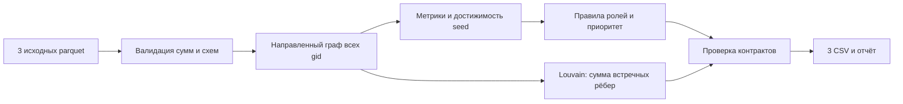

# MoneyGraph Investigator — UNRU AI

Локальный анализ обезличенной сети переводов: **кого проверить первым, какие наблюдаемые признаки это объясняют и где заканчиваются данные**. Роли — проверяемые структурные гипотезы, а не утверждения о виновности. `role_score` — нормализованная сила признаков, **не вероятность**: размеченных ролей нет.

**Состояние PHASE 1:** готов расчётный pipeline, три CSV, правила и тесты. Интерфейс, поиск по графу и AI-аналитик ещё не реализованы; этот checkpoint не является полной сдачей кейса. API и `.env` для него не нужны.

## Установка и одна команда запуска

Python **3.12**, обычный CPU, ориентир 2 GB свободной RAM. Интернет нужен только один раз для установки пакетов. Проверено на macOS arm64 / Python 3.12.14 в отдельном окружении, созданном с нуля; установка зависимостей выполнена через uv pip. Выполнять из корня этого репозитория:

```bash
python3.12 -m venv .venv
.venv/bin/python -m pip install -r requirements.txt
```

Полный пересчёт от исходных parquet до всех CSV одной командой:

```bash
.venv/bin/python -m moneygraph.pipeline
```

Исходные файлы организатора уже включены в `audit/source/data/data/`. Никакого аккаунта, API-ключа, GPU или ручной подготовки результатов не требуется. Другие входы/каталог результатов:

```bash
.venv/bin/python -m moneygraph.pipeline --data /path/to/data --out /path/to/results --top 50
```

Выход в `outputs/`:
- `nodes_roles.csv`: все узлы, обязательные поля `gid,role,role_score,cluster_id,priority_score,evidence` и дополнительные рассчитанные признаки/силы альтернативных ролей;
- `clusters.csv`: `cluster_id,n_nodes,n_seed,sum_kzt_internal,top_gids,hypothesis`;
- `top_nodes.csv`: `rank,gid,role,priority_score,why`; по умолчанию 50 узлов, минимум 20 (для входа меньше 20 — все узлы);
- `run_report.json`: измеренное время, версии, SHA-256 входов, контрольные суммы и статистика.

`evidence` содержит не более 200 символов. Все CSV в UTF-8, десятичная точка, разделитель запятая. Валидация выполняется до записи. Ошибка входных данных завершает команду с ненулевым кодом; ранее рассчитанные файлы не считаются новым успешным результатом.

Проверка:

```bash
.venv/bin/python -m pip install -r requirements-dev.txt
.venv/bin/python -m pytest -q
```

Тесты проверяют реальные схемы и полноту, устойчивость к перестановке строк, малые контрольные графы, границу depth=4, seed, изолированные узлы, изменение результата при изменении входа, точность денег и отказ при повреждении агрегатов.

## Как защищать роли

Сначала проверяется условие допуска роли, затем вычисляется сила её признаков. Выбирается максимальная сила **среди допущенных ролей**. При точном равенстве порядок: coordinator → distributor → consolidator → transit → terminal. Если ни одно условие не выполнено: peripheral, `role_score=0`. Это отсутствие достаточных признаков по данным правилам, а не свидетельство низкого риска. Все альтернативные силы сохраняются в `strength_*`.

Обозначения: `I/O` — число разных отправителей/получателей; `Ti/To` — число входящих/исходящих переводов; `Di` — число дней входящих переводов; `S` — число seed, из которых узел достижим направленным путём (для seed учитывается он сам); `R` — наблюдаемая исходящая сумма / входящая при положительном входе. `cap(x)=min(x,1)`. `Pi/Po/Ppr` — процентиль положительного входящего/исходящего оборота/PageRank. `Mi/Mo` — доля крупнейшего отправителя/получателя в соответствующей сумме.

| Роль | Условие допуска | Сила признаков (0–1) |
|---|---|---|
| consolidator | I≥3; O≤max(2,I/2) | 0.50·cap(I/8) + 0.30·(1−Mi) + 0.20·Pi |
| distributor | O≥5 | 0.55·cap(O/20) + 0.25·(1−Mo) + 0.20·Po |
| transit | не seed; положительные вход и выход; 0.8≤R≤1.2 | 0.50·max(0,1−abs(R−1)/0.2) + 0.25·cap(min(Ti,To)/5) + 0.25·cap(min(I,O)/3) |
| terminal | не seed; depth<4; O=0; 1≤I≤2; Ti≥3; Di≥2 | 0.40·cap(Ti/10) + 0.35·cap(Di/5) + 0.25·Pi |
| coordinator | I≥3; O≥3; S≥2 | 0.40·cap(min(I,O)/8) + 0.35·cap(S/5) + 0.25·Ppr |
| peripheral | ни одна из ролей выше не допущена | 0 |

Пороги — прозрачные эвристики стартовой версии; они не обучены и не валидированы на ground truth. Coordinator означает структурно связующий узел, а не установленного организатора. Consolidator отражает схождение связей, не доказанное накопление средств. Terminal — повторный наблюдаемый приём на внутреннем колене без видимого продолжения; **удержание средств не доказано**. Одного нулевого выхода недостаточно. У seed отношение потоков не участвует в присвоении transit; входы вне выборки неизвестны. У остальных отношение также описывает только видимые потоки. Точное время и происхождение конкретных денег не восстанавливаются.

## Приоритет и кластеры

`priority_score = 0.30·Pvolume + 0.25·Pneighbors + 0.20·cap(S/5) + 0.15·role_score + 0.10·Ppr`.

`Pvolume` — процентиль суммы вход+выход; `Pneighbors` — процентиль числа разных соседей независимо от направления. Процентили считаются среди положительных значений, одинаковым значениям присваивается средний ранг, нулевым — 0. Оборот вход+выход может учитывать один проход денег дважды: это активность узла, не новые деньги. PageRank вычисляется по направлению переводов с весом суммы (alpha=0.85). Изолированным узлам назначается приоритет 0: нет транзакционных фактов для ранжирования; их seed-статус и отсутствие данных сохраняются. Это не рекомендация игнорировать такие seed.

Приоритет не умножается на полноту наблюдений; важный узел на границе не теряется автоматически. Очереди аналитика и уровни наблюдаемости будут отдельным следующим этапом. `S` — достижимость, **не число независимых ветвей и не происхождение средств**. Топ сортируется по убыванию приоритета, при равенстве — по возрастанию gid. `why` приводит числа, участвующие в ранжировании.

Louvain: неориентированная проекция, встречные суммы складываются; resolution=1, seed=42. В граф изначально добавлены **все** gid, включая изоляты. ID кластеров упорядочены по минимальному gid, одиночные узлы сохраняются. Внутренний оборот — сумма оригинальных направленных рёбер внутри кластера, каждое ребро один раз. `top_gids` — до 5 участников по приоритету; гипотеза описывает только структуру. Фиксированный seed даёт воспроизводимость, **не доказательство устойчивости сообществ**.

## Проверенные данные и расхождения с описанием

2248 узлов, 3119 рёбер, 4840 транзакций, 81 seed; сумма 365 890 012.01 KZT. Суммы и количества по каждой паре согласованы между transactions и edges. Деньги сверяются в целых тиынах. 97 совпадающих строк транзакций сохранены: идентификатора транзакции нет, удаление могло бы потерять реальные платежи.

**16 edge-connected components; 35 components when isolated nodes from nodes.parquet are retained.** Здесь edge-connected означает слабосвязные компоненты графа из рёбер. Разница — 19 изолированных seed.

| out > in | Без допуска | Разница > 0.01 KZT |
|---|---:|---:|
| Все узлы | 377 | 377 |
| Seed | 42 | 42 |
| Не seed | 335 | 335 |
| Только положительный вход | 354 | 354 |
| Нулевой вход | 23 | 23 |

Число **354 из ТЗ воспроизводится при условии in>0**; 23 остальных — seed с нулевым наблюдаемым входом и положительным выходом. Это объяснение на основе данных; организатор не подтверждал, каким способом получал число. Обе агрегации (edges и transactions) дают одинаковый результат. Отчёт генерирует эти сравнения автоматически.

Все 444 узла depth=4 имеют нулевой выход, ни один не получает terminal. Ограничения выгрузки: исходящий обход до четырёх колен, один банк, июль 2026, платежи от 5000 KZT. Наблюдаемые потоки **не являются полным балансом**. Даты не содержат внутридневного времени. Отсутствующие сведения не достраиваются. Выводы и показатели качества ролей не заявляются как accuracy.

## Архитектура



Код: `moneygraph/io.py` — схемы и денежная точность; `features.py` — граф/метрики; `roles.py` — правила/рейтинг; `communities.py` — кластеры; `pipeline.py` — запуск/экспорт. Никаких списков «правильных gid» в реализации нет.

При росте до ~1 млн узлов: parquet-агрегации перенести в DuckDB/Polars с потоковой обработкой; NetworkX заменить компактным графовым движком (igraph/graph-tool или аналогом); PageRank/Louvain выполнять батчами; для достижимости большого количества seed использовать битовые множества на конденсации компонент сильной связности или ограниченный обход с явной маркировкой приближения. UI должен запрашивать ограниченные окрестности, не загружать миллион узлов. Текущая достижимость O(S·(V+E)), память графа O(V+E); масштабирование пока не реализовано и не измерено.

## Происхождение и ограничения использования

- [ТЗ Freedom / HackAlem](https://docs.google.com/document/d/1JPLU-G6R25Ge2hVaY2J9cqvrx7FGExj87XKwJPaMz3o/edit), локальная копия `docs/CASE_FINANCE.md`.
- Данные и исходный starter организатора: ссылки и хеши в `audit/PHASE_0.md` и `audit/source_sha256.json`. Данные разрешены **только для хакатона**, публичной лицензии на дальнейшее использование не заявлено.
- Предоставленный `starter.py` сохранён неизменённым в `audit/source/starter/starter/`. Схемы выходов и набор базовых метрик следуют заданию/starter; новый pipeline реализован в соревновании. Отдельная лицензия starter не указана; использование в рамках выданного кейса.
- pandas (BSD-3-Clause), NumPy (BSD-3-Clause; bundled components: 0BSD, MIT, Zlib, CC0-1.0), PyArrow / Apache Arrow (Apache-2.0), NetworkX (BSD-3-Clause), SciPy (BSD-3-Clause); для тестов pytest (MIT). Версии зафиксированы в requirements.
- Разработка и тестирование с помощью OpenAI Codex. Runtime LLM в PHASE 1 отсутствует, внешние AI-вызовы над данными не выполняются. Предварительные тренировочные проекты в решение не перенесены.
