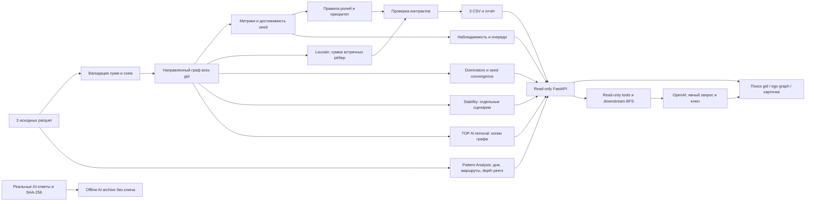

# MoneyGraph Investigator — UNRU AI

Локальный анализ обезличенной сети переводов: **кого проверить первым, какие наблюдаемые признаки это объясняют и где заканчиваются данные**. Роли — проверяемые структурные гипотезы, а не утверждения о виновности. `role_score` — нормализованная сила признаков, **не вероятность**: размеченных ролей нет.

**Состояние PHASE 11 (функции заморожены):** локальный pipeline, три CSV, наблюдаемость и очереди, UI с поиском любого GID, объяснимые гипотезы, AI-критик с поиском общего downstream для 1–5 источников, offline-архив реальных AI-ответов, Stability Lite, TOP-N removal и Pattern Analysis (время, маршруты, peer-аномалии). Основной продукт и архив работают без API-ключа и интернета. Ключ нужен только для нового ответа LLM. Формулы ролей/приоритета и три CSV побайтно совпадают с PHASE 1 (`09d2491`).

[Справочный сценарий для возможного финала](docs/DEMO_5_MIN.md) · [Подготовка сдачи](docs/SUBMISSION.md).

**PHASE 8 проверен в чистой копии `6e5da22`:** 92 Python tests + 7 JS checks; core 0.497 с, patterns 0.252 с. [Новая проверка](audit/phase8_clean_check.json). Зависимости прежние.

**Предыдущая чистая проверка `336b6e3` (до PHASE 8):** 85 Python-тестов + 3 JS renderer checks; три CSV совпадают по SHA-256. Первый расчёт после установки — 5.10 с, повторный — 0.47 с. UI, три случайных GID и offline-архив проверены без ключа. [Отчёт](audit/final_reproduction.json), [установленные версии](audit/final_environment.txt).

## Установка и одна команда запуска

Python **3.12**, обычный CPU, ориентир 2 GB свободной RAM. Интернет нужен только один раз для установки пакетов. Проверено на macOS arm64 / Python 3.12.14 в отдельном окружении, созданном с нуля; финальная проверка выполнена стандартным pip по командам ниже. Выполнять из корня этого репозитория:

```bash
python3.12 -m venv .venv
.venv/bin/python -m pip install -r requirements.txt
```

Полный пересчёт от исходных parquet до всех CSV одной командой:

```bash
.venv/bin/python -m moneygraph.pipeline
```

Исходные файлы организатора уже включены в `audit/source/data/data/`. Никакого аккаунта, API-ключа, GPU или ручной подготовки результатов не требуется. Другие входы/каталог результатов:

```bash
.venv/bin/python -m moneygraph.pipeline --data /path/to/data --out /path/to/results --top 50
```

Выход в `outputs/`:
- `nodes_roles.csv`: все узлы, обязательные поля `gid,role,role_score,cluster_id,priority_score,evidence` и дополнительные рассчитанные признаки/силы альтернативных ролей;
- `clusters.csv`: `cluster_id,n_nodes,n_seed,sum_kzt_internal,top_gids,hypothesis`;
- `top_nodes.csv`: `rank,gid,role,priority_score,why`; по умолчанию 50 узлов, минимум 20 (для входа меньше 20 — все узлы);
- `run_report.json`: измеренное время, версии, SHA-256 входов, контрольные суммы и статистика;
- `node_context.json`: отдельный слой интерпретации всех 2248 узлов: наблюдаемость, очередь, ограничения, следующий запрос данных и альтернативные роли. `gid` здесь строка: исходные int64 больше безопасного диапазона JavaScript Number.

`evidence` содержит не более 200 символов. Все CSV в UTF-8, десятичная точка, разделитель запятая. Валидация выполняется до записи. Ошибка входных данных завершает команду с ненулевым кодом; ранее рассчитанные файлы не считаются новым успешным результатом.

Проверка:

```bash
.venv/bin/python -m pip install -r requirements-dev.txt
.venv/bin/python -m pytest -q
```

Тесты проверяют реальные схемы и полноту, устойчивость к перестановке строк, малые контрольные графы, границу depth=4, seed, изолированные узлы, изменение результата при изменении входа, точность денег и отказ при повреждении агрегатов.

## Локальный интерфейс

После установки `requirements.txt` запустите из корня репозитория:

```bash
.venv/bin/python starter.py
```

Откройте **http://127.0.0.1:8010**. Одна команда пересчитывает parquet → CSV/JSON, Stability и Pattern Analysis, затем запускает FastAPI и статические HTML/CSS/JS. Node.js, npm, сборка frontend, интернет и API-ключ не нужны. Остановка: Ctrl+C. При занятом порте: `--port 8011`. Другие исходники/выход: `--data /path/to/data --out /path/to/results`.

Главный сценарий:

1. Выберите очередь: «Проверить», «Данные» или «Мониторинг». Узлы отсортированы по прежнему приоритету, показаны страницы по 25 записей.
2. Введите **полный gid** в поиск и нажмите «Найти»/Enter. Если введено начало gid — получите до 20 подходящих вариантов с общим числом совпадений. Неизвестный gid показывает понятное пустое состояние.
3. Слева очередь, в центре направленные переводы, справа карточка. Карточка раскрывает основную/альтернативную гипотезы, силу признаков, приоритет, наблюдаемость, факты, ограничения и следующий запрос данных.
4. Цвет узла — роль. Стрелка — направление реального ребра. Кнопка «Кластер N» выделяет участников кластера выбранного узла, остальные приглушаются. Обводка seed и подсказки помогают ориентироваться; полная информация о кластере расположена под графом.
5. Нажмите соседний узел, чтобы открыть его карточку и окружение. Наведение на ребро показывает полные gid, сумму и число переводов. Раздел «Точные суммы и направления» показывает их таблицей. Кнопки +/−/«По размеру» меняют масштаб; увеличенный граф можно прокручивать.
6. Скачайте три CSV по ссылкам внизу. Просмотр, поиск, переключение очередей и скачивание ничего не изменяют.

**GID всегда string в JSON и JavaScript.** CSV по ТЗ сохраняют точный int64. Подписи соседей в графе сокращены только визуально; полные значения доступны в подсказке, таблице и карточке. На больших окрестностях подписи соседей скрыты для читаемости, выбранный gid всегда подписан. Ни `Number(gid)`, ни `parseInt(gid)` не используются.

Ego graph — выбранный узел и его непосредственные входящие/исходящие соседи (1 hop). Показываются только рёбра, инцидентные выбранному узлу; связи соседей между собой не рисуются. Слева отправители и взаимные связи, справа остальные получатели. Взаимные направления нарисованы раздельно. По умолчанию максимум 160 узлов; при усечении показано предупреждение и число неотображённых соседей, отбор по исходному приоритету. На предоставленных данных все одноколенные окрестности укладываются в лимит. Нет 2 hops и полного overview: основной сценарий не требует загрузки 2248 точек одновременно.

Три демо-случая (это данные для проверки, не зашитая логика UI):

- `100000003115284100` → INVESTIGATE_NOW, consolidator, HIGH.
- `100000003684369100` → REQUEST_MORE_DATA, coordinator + alternative distributor, неполный upstream seed.
- `100000003037476100` → REQUEST_MORE_DATA, LOW, depth=4: запрос продолжения обхода.

Полный сценарий защиты на 5 минут: пересчёт и файлы (30 с) → различие очередей (45 с) → три карточки выше (2 мин) → произвольный gid жюри и его связи (1 мин) → ограничения и README (45 с).

### Read-only API

| GET endpoint | Результат |
|---|---|
| `/api/summary` | Числа узлов/рёбер/транзакций/кластеров, очереди, наблюдаемость, оборот, время последнего расчёта |
| `/api/queues/{queue}?offset=0&limit=25` | Страница очереди и total; limit≤200 |
| `/api/nodes/{gid}` | Карточка, рассчитанные метрики, альтернативы, ограничения, следующий запрос, кластер |
| `/api/nodes/{gid}/ego?max_nodes=160` | Направленная окрестность, string src/dst, суммы, n_tx; max_nodes≤250; отметка усечения |
| `/api/clusters/{cluster_id}` | Размер, seed, внутренний оборот, гипотеза и приоритетные участники |
| `/api/search?q=...&limit=20` | Точное совпадение в приоритете, иначе prefix; limit≤100 |
| `/api/download/{filename}` | Только nodes_roles.csv, clusters.csv, top_nodes.csv |

API-документация: `http://127.0.0.1:8010/docs`. Неизвестные gid/кластер/очередь/файл → 404, некорректные лимиты → 422. Сервер по умолчанию доступен только через loopback. Это локальное конкурсное приложение без многопользовательской авторизации и production-развёртывания.

## PHASE 4A: дополнительный evidence layer

`outputs/structural_evidence.json` добавляет данные ко всем карточкам `/api/nodes/{gid}`. Три CSV и `node_context.json` PHASE 2 не меняются. Ни dominator impact, ни новые статусы не пересчитывают primary role, role_score, priority_score, Louvain, очереди или сводную наблюдаемость.

### Зависимость наблюдаемых путей

К копии направленного графа добавляется искусственный источник с ребром к каждому seed. [NetworkX immediate_dominators](https://networkx.org/documentation/stable/reference/algorithms/generated/networkx.algorithms.dominance.immediate_dominators.html) строит дерево доминаторов для достижимых узлов. Для узла X:

- `dominated_nodes` — число **других** вершин в его поддереве; все наблюдаемые пути от seed к ним проходят через X;
- `dominated_clusters` — число разных прежних cluster_id среди этих вершин; кластер самого X добавляется только если в нём есть зависимый потомок;
- `sample_dominated_gids` — до 12 примеров (строки); если это не полный список, `sample_is_truncated=true`;
- недостижимый от seed узел получает NOT_EVALUABLE и null, не ложный ноль.

Счётчик = размер поддерева с X минус 1 = число строгих потомков. В предоставленном исследовании формула с «descendants − 1» имела ошибку на единицу; псевдокод с «subtree_size − 1» был верным. Это проверяют отдельные тесты на цепочке и листе.

В текущих данных 539 узлов имеют ненулевой impact. Максимум: gid `100000002527114100`, 269 узлов в 1 кластере. Другой пример: `100000003016635100`, 102 узла в 10 кластерах. Для пяти крупнейших случаев выполнена независимая проверка удаления узла в тестовой копии графа: число оставшихся узлов, утративших достижимость от seed, точно совпало. Это тест алгоритма, не новая продуктовая функция симуляции.

**Интерпретация ограничена наблюдаемой сетью.** Сбор через BFS и единственный seed в компоненте сами могут создавать доминаторов. Невидимые обходные маршруты могут отменить реальную зависимость; 0 на depth=4 описывает только обрезанную сеть. Метрика не означает контроль денег, распоряжение клиентами или подтверждение coordinator. Денежный объём «под контролем» не рассчитывается. Семантика без весов: речь о существовании направленных путей, а не о суммах.

### Доступность разных видов evidence

API хранит `evidence_availability` (статусы) и `evidence_details` (status, value, reason). В карточке показана таблица:

| Признак | Правило |
|---|---|
| fan_in | AVAILABLE для наблюдаемого не-seed входа; PARTIAL для seed или отсутствующего входа; число наблюдаемых отправителей сохраняется |
| fan_out | depth=4 → CENSORED/null; иначе при нулевом выходе PARTIAL/0, при наблюдаемом выходе AVAILABLE |
| transit | depth=4 → CENSORED/null; seed/изолят → NOT_EVALUABLE/null; остальные PARTIAL, сила правила только если видны обе стороны |
| terminal | depth=4, seed, изолят → NOT_EVALUABLE/null; остальные PARTIAL/сила прежнего правила: удержание не доказано |
| seed_reach | AVAILABLE — прежняя направленная достижимость, включая себя для seed; это не независимость ветвей |
| community | AVAILABLE — прежний ID структурного кластера, а не установленной группы |
| dominator | AVAILABLE для достижимых от seed; иначе NOT_EVALUABLE/null |

AVAILABLE означает вычислимость **в наблюдаемом графе**, а не полноту клиентской истории. Для depth=4 вход, reach и community остаются доступны, а outgoing/transit/terminal показаны как **N/A**. В старой таблице фактов при этом может оставаться «наблюдаемый выход = 0»: это число записей, а не оценка исходящего поведения. Никакой подмены исходных нулей и прежних scores нет.

Из идей исследования **не реализованы** disjoint paths и изменение сортировки запросов. Effective last-hop branches, AI Hypothesis Critic, Stability Lite и temporal compatibility добавлены в последующих фазах и описаны ниже. Предложенные новые формулы ролей и нормализации не перенесены в принятое ядро.

## Как защищать роли

Сначала проверяется условие допуска роли, затем вычисляется сила её признаков. Выбирается максимальная сила **среди допущенных ролей**. При точном равенстве порядок: coordinator → distributor → consolidator → transit → terminal. Если ни одно условие не выполнено: peripheral, `role_score=0`. Это отсутствие достаточных признаков по данным правилам, а не свидетельство низкого риска. Все альтернативные силы сохраняются в `strength_*`.

Обозначения: `I/O` — число разных отправителей/получателей; `Ti/To` — число входящих/исходящих переводов; `Di` — число дней входящих переводов; `S` — число seed, из которых узел достижим направленным путём (для seed учитывается он сам); `R` — наблюдаемая исходящая сумма / входящая при положительном входе. `cap(x)=min(x,1)`. `Pi/Po/Ppr` — процентиль положительного входящего/исходящего оборота/PageRank. `Mi/Mo` — доля крупнейшего отправителя/получателя в соответствующей сумме.

| Роль | Условие допуска | Сила признаков (0–1) |
|---|---|---|
| consolidator | I≥3; O≤max(2,I/2) | 0.50·cap(I/8) + 0.30·(1−Mi) + 0.20·Pi |
| distributor | O≥5 | 0.55·cap(O/20) + 0.25·(1−Mo) + 0.20·Po |
| transit | не seed; положительные вход и выход; 0.8≤R≤1.2 | 0.50·max(0,1−abs(R−1)/0.2) + 0.25·cap(min(Ti,To)/5) + 0.25·cap(min(I,O)/3) |
| terminal | не seed; depth<4; O=0; 1≤I≤2; Ti≥3; Di≥2 | 0.40·cap(Ti/10) + 0.35·cap(Di/5) + 0.25·Pi |
| coordinator | I≥3; O≥3; S≥2 | 0.40·cap(min(I,O)/8) + 0.35·cap(S/5) + 0.25·Ppr |
| peripheral | ни одна из ролей выше не допущена | 0 |

Пороги — прозрачные эвристики стартовой версии; они не обучены и не валидированы на ground truth. Coordinator означает структурно связующий узел, а не установленного организатора. Consolidator отражает схождение связей, не доказанное накопление средств. Terminal — повторный наблюдаемый приём на внутреннем колене без видимого продолжения; **удержание средств не доказано**. Одного нулевого выхода недостаточно. У seed отношение потоков не участвует в присвоении transit; входы вне выборки неизвестны. У остальных отношение также описывает только видимые потоки. Точное время и происхождение конкретных денег не восстанавливаются.

## Приоритет и кластеры

`priority_score = 0.30·Pvolume + 0.25·Pneighbors + 0.20·cap(S/5) + 0.15·role_score + 0.10·Ppr`.

`Pvolume` — процентиль суммы вход+выход; `Pneighbors` — процентиль числа разных соседей независимо от направления. Процентили считаются среди положительных значений, одинаковым значениям присваивается средний ранг, нулевым — 0. Оборот вход+выход может учитывать один проход денег дважды: это активность узла, не новые деньги. PageRank вычисляется по направлению переводов с весом суммы (alpha=0.85). Изолированным узлам назначается приоритет 0: нет транзакционных фактов для ранжирования; их seed-статус и отсутствие данных сохраняются. Это не рекомендация игнорировать такие seed.

Приоритет не умножается на полноту наблюдений; важный узел на границе не теряется автоматически. Очереди и пригодность наблюдений находятся в отдельном JSON и не меняют этот рейтинг. `S` — достижимость, **не число независимых ветвей и не происхождение средств**. Топ сортируется по убыванию приоритета, при равенстве — по возрастанию gid. `why` приводит числа, участвующие в ранжировании.

Louvain: неориентированная проекция, встречные суммы складываются; resolution=1, seed=42. В граф изначально добавлены **все** gid, включая изоляты. ID кластеров упорядочены по минимальному gid, одиночные узлы сохраняются. Внутренний оборот — сумма оригинальных направленных рёбер внутри кластера, каждое ребро один раз. `top_gids` — до 5 участников по приоритету; гипотеза описывает только структуру. Фиксированный seed даёт воспроизводимость, **не доказательство устойчивости сообществ**.

## PHASE 2: четыре независимых понятия

| Понятие | Что означает | Чего не означает |
|---|---|---|
| STRUCTURAL PRIORITY | Существующий `priority_score`: относительный приоритет проверки по структуре, обороту и силе роли | Вероятность нарушения; умножение на полноту |
| ROLE EVIDENCE | `primary_strength` = прежний `role_score`; наблюдаемая поддержка выбранного правила | Калиброванная уверенность или ground truth |
| OBSERVABILITY | Пригодность текущей ограниченной выгрузки для интерпретации этой гипотезы | Процент известных операций банка/клиента или вероятность |
| INVESTIGATION QUEUE | Какое действие предложено при заданных порогах приоритета, силы роли и наблюдаемости | Вердикт о клиенте или команда на блокировку |

### Детерминированная наблюдаемость

Стартовый индекс 0.90; для каждого обнаруженного ограничения применяется **потолок**, итог — минимум всех применимых потолков (не сумма штрафов). Все причины сохраняются независимо от того, какая дала минимум. Это открытая эвристика без статистической калибровки. HIGH ≥0.75; MEDIUM ≥0.45 и <0.75; LOW <0.45. Даже HIGH относится лишь к данной гипотезе в данной выборке, не означает полную историю.

| Известное ограничение | Максимальный индекс |
|---|---:|
| depth=4: граница исходящего обхода | 0.15 |
| Изолированный узел | 0.05 |
| Seed: неполный upstream | 0.55 |
| Нет наблюдаемых входящих | 0.35 |
| Нет исходящих: terminal-гипотеза / остальные роли | 0.55 / 0.35 |
| depth=3: следующее колено граничное | 0.65 |
| Входящих+исходящих транзакций меньше 3 | 0.35 |
| Меньше 2 дней на соответствующей роли стороне | 0.55 |
| У не-seed out−in>0.01 KZT: источник разницы не установлен | 0.55 |
| Transit: месячный коэффициент ещё не доказывает последовательность потоков | 0.65 |

Для consolidator/terminal учитываются дни входа, для distributor — выхода; для coordinator/transit — минимум дней входа и выхода; для peripheral — максимум. Сумма дней не используется: это могло бы дважды посчитать один день. Нулевой выход для terminal — часть гипотезы, но удержание без полной истории/остатков остаётся неподтверждённым. Превышение выхода над входом не объявляется ошибкой или нарушением: возможны начальный остаток и входящие вне обхода.

Общие ограничения (один банк, июль 2026, порог 5000 KZT, исходящий обход) записаны у каждого узла. Они не скрываются за HIGH, но и не превращают индекс в одинаково низкий для всех.

### Правила очередей

1. `priority_score < 0.75` → **MONITOR**.
2. Приоритет ≥0.75, `role_score ≥0.50` и `observability_score ≥0.60` → **INVESTIGATE_NOW**.
3. Остальные с приоритетом ≥0.75 → **REQUEST_MORE_DATA**.

Порядок проверок фиксирован, equality включается в верхнюю категорию. MEDIUM с индексом 0.65 допускает проверку существующих фактов, с 0.55 — отправляет важный узел в запрос данных. Пороги операционные и пока не валидированы на результатах расследований. **Запрос данных не исключает параллельного изучения имеющихся фактов**. Низкий индекс не уменьшает исходный приоритет. Изолированные seed имеют priority=0 по неизменённому PHASE 1 и поэтому MONITOR, но LOW, причины и запрос данных явно сохранены; эту очередь нельзя трактовать как разрешение игнорировать seed.

Для всех узлов сохранены `observability_reasons`, `data_gaps` (код + описание), `next_data_request`. Ничего не отправляется автоматически. Первый запрос выбирается по фиксированному порядку известных ограничений: граница → изолят → seed → отсутствие входа/выхода → близость к границе → мало переводов/дней → разница потоков → недостаток временной детализации transit. Остальные варианты — `possible_data_requests`. Порядок прозрачен, но не является доказанной оптимизацией ценности информации. Если специальных ограничений нет, предлагается соседний период для проверки повторяемости; никаких внешних атрибутов клиента не придумывается.

### Альтернативные роли

`primary_role/primary_strength` копируют текущую роль и силу. `alternative_role/alternative_strength` — максимальная положительная сила другого уже допущенного правила; равенства разрешаются прежним ROLE_ORDER. Если других допущенных правил нет: `null / 0`, а не выдуманная альтернатива. Все положительные альтернативы хранятся в `role_alternatives`. Это конкурирующие структурные интерпретации, не взаимоисключающие вероятности; сумма сил не обязана равняться 1.

### Измеренный результат PHASE 2

- HIGH / MEDIUM / LOW: **117 / 469 / 1662**.
- INVESTIGATE_NOW / REQUEST_MORE_DATA / MONITOR: **49 / 203 / 1996**.
- Один граничный узел имеет priority≥0.75: сохранён в REQUEST_MORE_DATA.
- Положительная альтернативная роль есть у 71 узла.

В `tests/phase1_csv_sha256.json` зафиксированы хеши CSV из коммита PHASE 1; тест не допускает скрытого изменения ролей, приоритетов, кластеров и топа при добавлении этого слоя. Подробнее с примерами — `audit/PHASE_2.md`.

## Проверенные данные и расхождения с описанием

2248 узлов, 3119 рёбер, 4840 транзакций, 81 seed; сумма 365 890 012.01 KZT. Суммы и количества по каждой паре согласованы между transactions и edges. Деньги сверяются в целых тиынах. 97 совпадающих строк транзакций сохранены: идентификатора транзакции нет, удаление могло бы потерять реальные платежи.

**16 edge-connected components; 35 components when isolated nodes from nodes.parquet are retained.** Здесь edge-connected означает слабосвязные компоненты графа из рёбер. Разница — 19 изолированных seed.

| out > in | Без допуска | Разница > 0.01 KZT |
|---|---:|---:|
| Все узлы | 377 | 377 |
| Seed | 42 | 42 |
| Не seed | 335 | 335 |
| Только положительный вход | 354 | 354 |
| Нулевой вход | 23 | 23 |

Число **354 из ТЗ воспроизводится при условии in>0**; 23 остальных — seed с нулевым наблюдаемым входом и положительным выходом. Это объяснение на основе данных; организатор не подтверждал, каким способом получал число. Обе агрегации (edges и transactions) дают одинаковый результат. Отчёт генерирует эти сравнения автоматически.

Все 444 узла depth=4 имеют нулевой выход, ни один не получает terminal. Ограничения выгрузки: исходящий обход до четырёх колен, один банк, июль 2026, платежи от 5000 KZT. Наблюдаемые потоки **не являются полным балансом**. Даты не содержат внутридневного времени. Отсутствующие сведения не достраиваются. Выводы и показатели качества ролей не заявляются как accuracy.

## Архитектура



Код: `moneygraph/io.py` — схемы и денежная точность; `features.py` — граф/метрики; `roles.py` — правила/рейтинг; `communities.py` — кластеры; `pipeline.py` — запуск/экспорт; `observability.py` — отдельный слой ограничений и очередей. Никаких списков «правильных gid» в реализации нет.

При росте до ~1 млн узлов: parquet-агрегации перенести в DuckDB/Polars с потоковой обработкой; NetworkX заменить компактным графовым движком (igraph/graph-tool или аналогом); PageRank/Louvain выполнять батчами; для достижимости большого количества seed использовать битовые множества на конденсации компонент сильной связности или ограниченный обход с явной маркировкой приближения. UI должен запрашивать ограниченные окрестности, не загружать миллион узлов. Текущая достижимость O(S·(V+E)), память графа O(V+E); масштабирование пока не реализовано и не измерено.

## Происхождение и ограничения использования

- [ТЗ Freedom / HackAlem](https://docs.google.com/document/d/1JPLU-G6R25Ge2hVaY2J9cqvrx7FGExj87XKwJPaMz3o/edit), локальная копия `docs/CASE_FINANCE.md`.
- Данные и исходный starter организатора: ссылки и хеши в `audit/PHASE_0.md` и `audit/source_sha256.json`. Данные разрешены **только для хакатона**, публичной лицензии на дальнейшее использование не заявлено.
- Предоставленный `starter.py` сохранён неизменённым в `audit/source/starter/starter/`. Схемы выходов и набор базовых метрик следуют заданию/starter; новый pipeline реализован в соревновании. Отдельная лицензия starter не указана; использование в рамках выданного кейса.
- pandas (BSD-3-Clause), NumPy (BSD-3-Clause; bundled components: 0BSD, MIT, Zlib, CC0-1.0), PyArrow / Apache Arrow (Apache-2.0), NetworkX (BSD-3-Clause), SciPy (BSD-3-Clause); FastAPI (MIT), Uvicorn (BSD-3-Clause); для тестов pytest (MIT), HTTPX (BSD-3-Clause). SVG-рендерер интерфейса написан в ходе конкурса; сторонние frontend-библиотеки и CDN не используются. Версии зафиксированы в requirements.
- Разработка и тестирование с помощью OpenAI Codex. Runtime AI добавлен в PHASE 5 как необязательный read-only критик через OpenAI Responses API; условия передачи данных описаны ниже. Предварительные тренировочные проекты в решение не перенесены.

## PHASE 4B: разнообразие последних входящих ветвей

`outputs/seed_convergence.json` — отдельный evidence layer; доступен в
`GET /api/nodes/{gid}` как `seed_convergence` и в карточке узла.
Роли, рейтинг, очереди, Louvain, observability, три CSV и PHASE 4A не меняются.

Для целевого узла `v` и каждого непосредственного отправителя `p` находим
множество seed, достигающих `p` **в графе без v**. Нулевой путь seed→сам seed
разрешён для отправителя, но сам целевой seed исключён. Это предотвращает
ложное схождение через циклы `v→…→p→v`. Поэтому используем target-specific
reverse traversal, а не глобальные seed-множества, загрязнённые такими возвратами.
Для seed `s`, достигающего `m(s)` последних ветвей, каждая получает `1/m(s)`.

```text
mass(p) = Σ[seed s reaches p without v] 1/m(s)
q(p) = mass(p) / Σ mass
effective_last_hop_branches = exp(-Σ q(p) * ln(q(p)))
```

Если поддержанных ветвей нет, результат 0: наблюдаемых внешних seed-входов нет.
Это не утверждение о связях вне выгрузки. `external_seed_count` считает только
внешние seed; исходный `reachable_seed_count` сохранён, включая self-reach для seed.
`branches` содержит точный строковый `predecessor_gid`, число seed, массу и долю;
сумма масс равна числу внешних seed. Сортировка и `math.fsum` обеспечивают
детерминизм при перестановке входных строк. Худшая сложность O(E·(V+E));
перебор простых путей и max-flow не используются.

Это **last-hop diversity, не независимые пути и не прослеживание денег**.
Один seed может разветвиться: эффективных ветвей может быть больше, чем seed.
Ветви могут пересекаться upstream; масса не учитывает суммы переводов и время.
При depth=4 входящая достижимость остаётся измеримой, выход остаётся цензурированным.
Ограничения одного банка, месяца, порога и исходящего обхода сохраняются.

Проверка PHASE 4B: 48 тестов; pipeline 0.4416 с, pipeline + загрузка UI store
0.545 с на машине участника (не гарантия для другого оборудования).
Из 2248 узлов: 50 имеют 0 ветвей, 1806 — ровно 1, 392 — больше 1;
среднее 1.3031, медиана 1, максимум 20.0603.
Подробнее: [audit/PHASE_4B.md](audit/PHASE_4B.md).

Уточнение для защиты: 91 — все вычисленные сообщества, включая одиночные;
из них **8 содержат больше одного seed**. Эти числа описывают разные срезы.


## PHASE 5: AI Hypothesis Critic

AI помогает оспорить структурную гипотезу, сопоставить узлы и выбрать следующий
запрос данных. Детерминированный движок назначает роли и приоритеты; AI только
интерпретирует результаты, не меняя CSV, очереди, граф или рейтинг.
Панель находится под рабочим пространством; доступны свободный вопрос,
«Оспорить основную гипотезу», сравнение двух GID и отдельное поле 1–5 источников для поиска общего downstream.

### Включение и запуск

В корне этого репозитория создайте `.env` по `.env.example`, задайте
`OPENAI_API_KEY` и при необходимости `OPENAI_MODEL` (по умолчанию `gpt-5.4-mini`).
Переменные процесса имеют приоритет. Ключ читается сервером и не отдаётся браузеру.
Запуск прежний: `python -m moneygraph.server`. Дополнительных SDK/библиотек нет:
HTTPS JSON-запросы через Python standard library, Responses API и function calling.
Используются FastAPI/Pydantic для валидации. Панель не отправляет запросы автоматически.

Без ключа: «AI analyst unavailable», основная аналитика полностью доступна.
При сетевой ошибке, нехватке кредита, недоступной модели, превышении лимита
или malformed response показывается ошибка, без выдуманного AI-ответа.
GET `/api/analyst/status` сообщает только наличие настройки, не доказывает
валидность ключа. POST `/api/analyst/ask` принимает `gid`, `question` и
необязательные `compare_gid` или `source_gids` (1–5 строк); возвращает NDJSON activity/result/error.
Сервер локальный, по умолчанию 127.0.0.1; публичного доступа/авторизации нет.

### Инструменты и протокол

- `get_node_profile(gid)` — роли/силы, сильнейшая альтернатива, метрики,
  очередь, наблюдаемость, seed reach, last-hop diversity, вклады приоритета.
- `get_structural_evidence(gid)` — dominator и пригодность каждого признака.
- `compare_nodes(gid_a, gid_b)` — оба профиля, структурные признаки, data gaps,
  вклады рейтинга и их разности, преимущества второго узла по вкладам.
- `get_neighbors(gid)` — до 30 направленных инцидентных связей по сумме,
  суммы/count и явное указание обрезки; это не полная сеть.
- `get_data_gaps(gid)` — причины неполноты, CENSORED/N/A, следующий запрос.
- `get_cluster_context(gid)` — размер/seed/оборот кластера, top nodes и гипотеза.
- `find_common_downstream(gids, max_hops)` — детерминированный BFS от 1–5 источников,
  до четырёх переходов. До 20 кандидатов с покрытием и одним кратчайшим путём
  от каждого достигшего источника. Входные узлы исключаются из кандидатов;
  для нескольких источников требуется покрытие минимум двух. Сортировка:
  покрытие ↓, максимальная длина пути ↑, прежний priority ↓, точный GID ↑.
  Общее число кандидатов и усечение указаны отдельно; 4/5 не считается общим для всех.
  Пути агрегированного графа не доказывают движение одних и тех же денег или временной порядок.

Модель сама выбирает инструменты. Для индивидуального анализа/сравнения сервер требует профиль, structural evidence
и gaps для каждого запрошенного узла до выдачи ответа; compare покрывает все
три для обоих и обязателен при двух GID. Вывод содержит заключение, 2–4 основания,
альтернативу, возражения, ограничение, следующий шаг и ссылки T1… на инструменты.
Структура JSON и ссылки проверяются. Сервер также требует упоминания существующей сильнейшей альтернативы и явной неопределённости terminal на depth=4; при несогласованности модель получает запрос исправления в пределах того же лимита шагов. Activity log отражает выполненные tools,
не скрытые рассуждения. В групповом режиме обязательный инструмент —
`find_common_downstream` для всех указанных источников; проверки альтернативных
ролей отдельных входных узлов здесь не применяются. Семантика ответа группы
не проверяется формально: сравнивайте покрытие и GID с результатами инструмента.
До пяти GID для downstream; индивидуальный анализ/сравнение — один/два GID.
Лимиты: 16 tool calls,
5 запросов к модели и один AI-запрос одновременно. Каждый HTTP-вызов ограничен
45 секундами; новые шаги после 120 секунд не запускаются. UI ждёт до 150 секунд.

### Передаваемые данные

По нажатию пользователем отправляются вопрос, выбранные GID, инструкции и схемы
инструментов, затем только результаты реально вызванных tools: рассчитанные
метрики/роли/суммы, ограничения, локальные связи, агрегаты кластера или до 20 downstream-кандидатов с путями.
Полные parquet/CSV/JSON и вся сеть не отправляются. GID — точные строки.
GID из соседей/кластера не дают модели право запрашивать новые узлы: допустимы
только GID выбранного узла, явно указанные в вопросе, поле сравнения или списке источников.
Каждый вопрос обрабатывается отдельно, истории диалога и локальной памяти нет.
`store=false`; это параметр хранения Responses, не обещание отсутствия
всех видов обработки/логирования у провайдера. Ответы демо вручную сохраняются
только скриптом проверки; сервер не пишет тела запросов или ключи в логи.

### Ограничения и воспроизводимость

Роль — гипотеза; strength не вероятность. Depth=4 цензурирует выход,
seed имеет неполную входящую историю. Dominator не означает контроль денег.
Поле переименовано в `effective_last_hop_branches` без изменения расчёта:
это разнообразие последних входов, а не число независимых маршрутов.
Новые личности, внешние данные, виновность и новые роли не выводятся.
Инструкции и обязательные tools уменьшают риск выдумок, но семантическая
истинность каждого предложения LLM не гарантируется: аналитик должен сверять
ссылки и числа с карточкой. Формальная проверка всех числовых утверждений
не реализована. При отсутствии преимущества второго узла нельзя его выдумывать.

Все Python unit/API tests работают без сети: `python -m pytest -q`.
Дополнительно при установленном Node: `node tests/test_analyst_frontend.cjs`
проверяет malformed/error ответы и текстовый рендеринг без исполнения HTML.
`python scripts/check_analyst.py` выводит локальный предварительный состав
шести демо без внешнего запроса.
`python scripts/check_analyst.py --live` **передаёт данные в OpenAI и расходует
API-кредиты**; используется только при разрешённой передаче данных.
Модель, качество ответов и задержка зависят от доступности API;
offline-критерии не требуют личного аккаунта.

Официальная документация, сверенная при реализации:
[Responses function calling](https://developers.openai.com/api/docs/guides/function-calling),
[GPT-5.4 mini](https://developers.openai.com/api/docs/models/gpt-5.4-mini).

## Архив реальных AI-ответов без ключа

Откройте `/ai-archive` (ссылка под живой AI-панелью). Это локальный просмотр
шести **реальных ранее выполненных** демо-вопросов PHASE 5: вопрос, GID,
ответ, модель, исходная задержка и журнал tools. Нового вызова OpenAI нет,
ключ/кредиты не нужны. Для других GID показывается отсутствие записи;
архив не выдаётся за AI-обработку всех 2248 узлов или за живую генерацию.

Ответы показываются без переписывания из `audit/phase5_live_verification.json`.
Манифест `audit/ai_archive_manifest.json` фиксирует исходный коммит, SHA-256
записи, входных данных и расчётных артефактов. При изменившихся данных страница
предупреждает, что архив относится к прежней версии; при повреждении записи
ответы не показывает. Хеш — проверка неизменности локального файла, не подпись
провайдера. Точное время исходных вызовов и полные HTTP/tool payloads не
сохранялись; дата демо и журнал вызванных инструментов сохранены.

## PHASE 6: Stability Lite — отдельная диагностика

`python -m moneygraph.stability` читает те же parquet и пишет только
`outputs/stability.json`. Сначала должны существовать обычные outputs.
В репозитории диагностика уже сохранена; сервер читает её без пересчёта
при открытии страницы. При отсутствии или несовпадении хешей показывает N/A
и продолжает работать. После изменения данных: сначала обычный pipeline,
затем эта команда. Доступна сводка `/api/stability/summary` и поле `stability`
в карточке `/api/nodes/{gid}`. Stability не добавляется в tools AI;
AI-ответы в архиве не содержат эту новую диагностику.

Проверки разделены на две семьи, результаты не смешиваются:

| Параметрический сценарий | Изменение |
|---|---|
| volume_plus10 / volume_minus10 | вес объёма priority ×1.1 / ×0.9 |
| neighbors_plus10 / neighbors_minus10 | вес соседей priority ×1.1 / ×0.9 |
| seed_reach_plus10 | вес seed reach priority ×1.1 |
| without_pagerank | вес PageRank priority =0 |
| role_first_component_plus10 / minus10 | первый компонент evidence каждой роли ×1.1 / ×0.9 |
| thresholds_stricter / looser | перечисленные ниже входные пороги +1 / −1 |

После изменения веса priority или evidence нормируются к сумме 1 в своей
формуле. В threshold-сценариях меняются coordinator in/out degree ≥3 и seed ≥2,
distributor out degree ≥5, consolidator in degree ≥3, terminal tx ≥3 и days ≥2.
Для transit допустимое out/in окно — 0.85–1.15 / 0.75–1.25; формула близости
к 1 сохраняет исходный знаменатель 0.2, при отрицательном значении обрезается
нулём. Остальные пороги/нормировки, запрет terminal для seed/depth=4 и порядок
разрешения равенств сохраняются. No-PageRank — намеренно более сильная ablation,
а не «небольшое ±10% изменение». Сценарии общие, без настройки под GID.

Edge dropout: три фиксированных random seeds **42, 43, 44**. Из сортированного
списка 3119 aggregated edges без возвращения удаляются ceil(5%)=156 рёбер;
соответствующие исходные транзакции также исключаются. Все 2248 узлов и
первоначальные seed/depth сохраняются. Метрики, seed reach, PageRank, роли и
приоритет пересчитываются только в диагностической копии. Кластеры/очереди
не пересчитываются и их устойчивость этим тестом не оценивается.

Для каждой семьи: доля совпадений роли с baseline, доля вхождений в TOP-20,
другие наблюдавшиеся роли; диапазон ранга показывается для baseline TOP-100
и любого узла, попавшего в TOP-20 хотя бы в одном сценарии. Равенства ранга
разрешаются точным числовым GID как в baseline. Для исходных 19 изолятов — N/A.
STABLE означает совпадение роли минимум в 90% сценариев данной семьи:
9/10 допустимо, при 3 dropout runs требуется 3/3. Это условность отображения.
Оценка ранга видна отдельно: STABLE у роли не гарантирует стабильного места.

Диагностическая доля — **не accuracy, вероятность, confidence interval или
статистическая значимость**. Равномерное удаление рёбер — stress test, не модель
реальной неполноты банковской выгрузки. Все сценарии ограничены выбранными
настройками; устойчивость не доказывает правильность роли. Большое число
peripheral влияет на общую долю STABLE. Сценарии не независимые наблюдения.

Измерения: диагностика 0.4975 с до сериализации; обычный pipeline не изменён.
72 Python tests и 3 JS renderer checks проходят. Подробности и примеры —
[audit/PHASE_6.md](audit/PHASE_6.md).

## PHASE 7: Network Resilience / TOP-N removal

Панель на главной странице: удаление TOP-1/3/5/10 и «Сбросить симуляцию».
`GET /api/resilience?n=0|1|3|5|10` возвращает готовый сценарий. Все пять
вариантов вычисляются при создании приложения (около 0.05 с суммарно),
переключение не запускает новый pipeline. N=0 — исходный граф.

Берётся исходный directed graph со всеми 2248 узлами, включая 19 изолятов.
TOP-N выбран по **существующему** priority_score с разрешением равенств по GID.
Удаляются узлы и инцидентные рёбра только в копии графа. Роли, очереди, Louvain,
наблюдаемость, CSV, AI, Stability и основной ego-граф не меняются. Удалённые
seed перечисляются явно. Карточки и граф над симуляцией остаются baseline.

Метрики до/после: weak components, размер крупнейшей компоненты, изоляты,
оставшиеся seed, направленная достижимость от любого оставшегося seed
(включая сам seed), компоненты с несколькими seed. Weak components — не
Louvain-кластеры: в baseline 35 компонент и 2 multi-seed компоненты, тогда как
Louvain даёт 91 кластер и 8 multi-seed кластеров.

Общая потеря = `(reachable_before - reachable_after) / reachable_before`.
Она включает удалённые узлы. Отдельно показаны удалённые ранее достижимые и
**оставшиеся**, потерявшие путь. Доля для оставшихся использует знаменатель
`reachable_before minus removed`, чтобы не выдавать само удаление за разрыв
связности. Если знаменатель нулевой, отображается N/A, а не фиктивные 0%.

`new_fragments` — сумма `max(число частей исходной компоненты после удаления − 1, 0)`.
Полностью удалённые исходные компоненты считаются отдельно, поэтому чистое
изменение числа компонент может быть отрицательным и не тождественно новым
фрагментам. Directed reachability loss также не равна распаду weak components:
направленный путь может исчезнуть без разрыва ненаправленной связности.

Это structural counterfactual наблюдаемого среза, не прогноз реакции реальных
участников, не денежный ущерб и не доказательство разрушения преступной группы.
Перестроение связей, альтернативные банки/маршруты и новые операции неизвестны.
Baseline reachability=2248 связано с seed-originated выборкой и включением
самого seed; это не доказательство полноты реальной сети.

Проверено 79 Python tests + 3 JS renderer checks, все сценарии и Reset в браузере.
Измерения, таблица и определения: [audit/PHASE_7.md](audit/PHASE_7.md).
Temporal добавлен отдельным слоем PHASE 8, см. следующий раздел.

## PHASE 8: Pattern Analysis — время, маршруты, peer-аномалии

В каждой карточке раскрываемый блок «Паттерны». Это **отдельный** расчёт:

```bash
.venv/bin/python -m moneygraph.patterns
```

В репозитории уже есть `outputs/patterns.json`. Команда воспроизводит его из
трёх parquet, не читая и не меняя роли, priority, очереди, CSV или Stability.
После изменения входных данных сначала обычный pipeline, затем patterns.
Параметры: `--data`, `--out`, `--period-start`, `--period-end`; по умолчанию
период из ТЗ **2026-07-01…2026-07-31**, не min/max присутствующих транзакций.
Выход за объявленный период — ошибка. Сервер проверяет SHA-256 исходников,
схему и полноту GID. При отсутствии/устаревании/повреждении — N/A, основное
приложение работает. Сводка: `/api/patterns/summary`; подробности — `patterns`
в обычной карточке `/api/nodes/{gid}`. AI-tools и сохранённый AI-архив этот
новый слой не получают; новые внешние API-запросы для PHASE 8 не выполнялись.

### Временная совместимость

Даты сведены к календарным дням, деньги — integer tiyn. Для каждого узла
строится маленькая потоковая сеть: source → входной день → выходной день → sink.
Между днями есть ребро только при задержке **+1 или +2 дня**. Ёмкости входных
и выходных bucket равны наблюдаемой сумме; max-flow не использует одну сумму
дважды. Входы допускаются только при `in_date + 2 days <= period_end`:
30–31 июля исключены из знаменателя и отдельно показаны как right-censored.
Выходы последних дней могут покрывать более ранние допустимые входы.

`compatibility_fraction = max_flow / eligible_incoming`; при нулевом
знаменателе N/A. Это **максимальный совместимый объём**, не оценка реально
прошедших средств. Вневыборочные входы и начальный остаток неизвестны.
Same-day overlap = сумма `min(in_day, out_day)`, отдельно **ORDER UNKNOWN**;
не суммировать с max-flow. Для depth=4 исходящий temporal, same-day overlap
и gather→scatter — CENSORED/N/A, не 0%.

Gather→scatter: ≥3 различных отправителя за день и ≥3 различных получателя
в объединении следующих двух дней, с полным +2 follow-up. Окна могут
перекрываться; суммы эпизодов нельзя складывать как независимые потоки.
Всплеск: ≥5 входящих+исходящих операций за день и ≥50% наблюдаемых операций
узла за весь период. Это описательный порог, не статистическая значимость.

### Повторяющиеся маршруты и возвраты

- A→B→C, три различных узла. На каждой паре рёбер сопоставляются даты через
  +1/+2 дня: входные даты по возрастанию, ближайшая ещё не использованная
  выходная дата. Требуется ≥2 пары. Каждый day-bucket каждого ребра используется
  максимум один раз **в данной цепочке**. Календарная дата может быть выходом
  одного эпизода и входом следующего на другом ребре. Разные цепочки могут
  разделять транзакции. Суммы не трассируются; эпизоды — пары дней, не число
  доказанных денежных маршрутов.
- Reciprocal: обе направленные связи A→B и B→A присутствуют в месячном графе;
  показаны суммы каждого направления. Это не утверждение о возврате тех же денег.
- Простые направленные циклы длины 3–4. Минимальный GID выбирается началом,
  вращения не дублируются; обратное направление — другой цикл. Ограниченный DFS,
  без `all_simple_paths`: максимум 10 000 циклов или 200 000 просмотренных
  расширений. При достижении лимита явно показана неполнота; числа становятся
  нижними границами. Время/суммы по циклу не согласовываются.

В карточке считаются маршруты с участием узла в любой позиции; до 10 примеров
каждого типа. Кнопки GID открывают карточки. Подсветка выделяет только рёбра,
присутствующие в текущем ego graph, и сообщает число отображённых рёбер полного
пути. Не дорисовываются отсутствующие в окрестности связи.

### Объяснимые отклонения от depth-peer группы

Для каждого depth отдельно (включая нулевые значения и изоляты): число
отправителей/получателей, входящий объём, вход+выход, число транзакций,
максимум различных отправителей/получателей за день. Процентиль = средний ранг
равных значений / размер группы. Сигнал: процентиль ≥0.99 и значение >0,
группа ≥20; иначе SMALL_COHORT/N/A. Не применяется к внешнему населению.
На depth=4 исходящие, общий объём, общее число транзакций и daily fan-out
CENSORED/N/A. Входящие остаются наблюдаемыми, но не полной историей.
У seed вход тоже неполон, даже в сравнении с другими seed.

Отдельное правило равных сумм: один отправитель в один день переводит одинаковую
сумму (до тиына) минимум трём различным получателям. Дубли строк сохраняются,
но один получатель не считается тремя. Это наблюдаемое распределение равных
сумм, **не доказательство дробления**; операции <5000 KZT в данных отсутствуют.
Branch diversity не включена в новые процентили: её исходная метрика остаётся
отдельной. Число flags — число сработавших правил, не вероятность/accuracy.

На предоставленных данных: 86 повторяющихся цепочек, 177 reciprocal pairs,
210 циклов (полный поиск длин 3–4), 8 узлов с gather→scatter, 98 узлов с peer flags,
6 узлов с распределением равных сумм. Время нового расчёта ~0.26 с до записи JSON.
92 Python tests + 3 AI renderer checks + 4 pattern renderer checks.
Дополнительная JS-проверка: `node tests/test_patterns_frontend.cjs`.

Базовый structural evidence сохранён: сила transit по-прежнему рассчитана без temporal. При наличии Pattern Analysis UI уточняет это в подсказке, не изменяя исторические JSON или AI-архив.

## Единая точка запуска и русский интерфейс

Проверено: 93 Python-теста + 13 JS-проверок. Запуск `starter.py --no-ui` проверен из другого рабочего каталога; запуск сервера — в окружении, установленном по README, без ключа.

После установки `requirements.txt` готовый проект запускается из корня:

```bash
.venv/bin/python starter.py
```

Команда последовательно пересчитывает core → Stability → Pattern Analysis,
затем запускает интерфейс **http://127.0.0.1:8010**. Ключ не требуется.
Остановка Ctrl+C. Другой порт: `--port 8011`. Только расчёт без сервера:

```bash
.venv/bin/python starter.py --no-ui
```

Поддерживаются `--data /path/to/data` и `--out /path/to/results`.
Диагностика паттернов в общем стартере рассчитана на период официального кейса,
июль 2026; для другого периода используйте отдельную команду patterns с датами.
Исходная команда `python -m moneygraph.pipeline` сохранена для минимального
обязательного сценария. Наш `starter.py` — точка запуска готового решения;
организаторская заготовка с пустыми ролями сохранена в `audit/source/starter/`
для происхождения кода. Её README не требует использовать заготовку как
единственный способ запуска финального продукта.

Русификация выполнена в `web/i18n.js`: словарь отображаемых терминов,
текстовые узлы, подписи и подсказки. Значения input/textarea, URL, data-атрибуты,
имена API-полей, role enum, очереди, CSV, Python и расчётные JSON не переводятся.
PageRank доступен в «Подробнее о расчёте». Суммы показаны в ₸. В архиве
есть исходный ответ без словарных замен; исходный JSON и его хеши прежние.

Намеренно сохранены: бренд **MoneyGraph Investigator**, **HackAlem / UNRU AI**,
провайдер **OpenAI**, ID узла, API/JSON/SHA-256 в техническом контексте,
название модели, PageRank в раскрываемом расчёте. Имена функций, полей и
английские термины в раскрываемой исходной записи/метаданных — оригинал,
а не непереведённая навигация. README сохраняет технические идентификаторы.

Проверки локализации: `node tests/test_localization.cjs`.

### Методика расчёта в интерфейсе

`/methodology` — локальная страница с 17 раскрывающимися разделами: данные,
граф, признаки, роли, приоритет, кластеры, достаточность данных, очереди,
зависимость путей, схождение, устойчивость ролей, удаление узлов,
временные признаки, маршруты, отклонения, ИИ и ограничения.
Ссылка «Показать расчёт этой роли» в карточке открывает выбранный GID,
условия допуска и реальные численные вклады в силу роли.

Формулы и предикаты извлекаются из AST установленного `roles.py`, без второго
набора весов. Пороги очередей импортируются из `observability.py`; потолки
наблюдаемости и параметры Louvain извлекаются из кода. Числа диагностик
читаются из проверенных результатов Store. Все пять ролей для всех 2248 узлов
сверяются с ядром тестом; вывод округлён до шести знаков.
`tests/methodology_source_hashes.json` требует пересмотреть поясняющий текст
при изменении описываемых алгоритмов. После осмысленной сверки методики
обновите соответствующий хеш; не обновляйте манифест вслепую.
Страница не вызывает LLM и не меняет Store, расчёты или CSV.

### Компоновка вкладки «Граф»

На desktop рабочая область высотой 720–750 px: очередь, локальный граф,
инспектор с вкладками «Обзор», «Структура», «Паттерны», «Устойчивость», «Данные».
Длинное содержимое прокручивается внутри колонок. Детали кластера и удаления
TOP-N раскрываются отдельно. На tablet инспектор расположен под графом,
на mobile блоки идут последовательно. Методика и архив сохраняют оформление.
Проверены 1440×900, 1536×960, 1728×1117, 1024×768 и 390×844.
Дополнительные проверки вкладок: `node tests/test_inspector_frontend.cjs`.
На текущем этапе конкурса презентация не готовится; сохранённый сценарий —
только справочный материал на случай выхода в финал.
