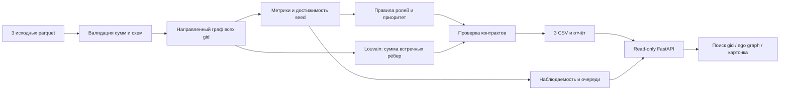

# MoneyGraph Investigator — UNRU AI

Локальный анализ обезличенной сети переводов: **кого проверить первым, какие наблюдаемые признаки это объясняют и где заканчиваются данные**. Роли — проверяемые структурные гипотезы, а не утверждения о виновности. `role_score` — нормализованная сила признаков, **не вероятность**: размеченных ролей нет.

**Состояние PHASE 3:** готовы pipeline, три CSV, наблюдаемость, очереди и локальный интерфейс с поиском любого gid, направленным графом соседей и карточками гипотез. Temporal и runtime AI-аналитик ещё не реализованы. API и `.env` для него не нужны. Формулы ролей/приоритета и три CSV побайтно совпадают с PHASE 1 (`09d2491`).

## Установка и одна команда запуска

Python **3.12**, обычный CPU, ориентир 2 GB свободной RAM. Интернет нужен только один раз для установки пакетов. Проверено на macOS arm64 / Python 3.12.14 в отдельном окружении, созданном с нуля; установка зависимостей выполнена через uv pip. Выполнять из корня этого репозитория:

```bash
python3.12 -m venv .venv
.venv/bin/python -m pip install -r requirements.txt
```

Полный пересчёт от исходных parquet до всех CSV одной командой:

```bash
.venv/bin/python -m moneygraph.pipeline
```

Исходные файлы организатора уже включены в `audit/source/data/data/`. Никакого аккаунта, API-ключа, GPU или ручной подготовки результатов не требуется. Другие входы/каталог результатов:

```bash
.venv/bin/python -m moneygraph.pipeline --data /path/to/data --out /path/to/results --top 50
```

Выход в `outputs/`:
- `nodes_roles.csv`: все узлы, обязательные поля `gid,role,role_score,cluster_id,priority_score,evidence` и дополнительные рассчитанные признаки/силы альтернативных ролей;
- `clusters.csv`: `cluster_id,n_nodes,n_seed,sum_kzt_internal,top_gids,hypothesis`;
- `top_nodes.csv`: `rank,gid,role,priority_score,why`; по умолчанию 50 узлов, минимум 20 (для входа меньше 20 — все узлы);
- `run_report.json`: измеренное время, версии, SHA-256 входов, контрольные суммы и статистика;
- `node_context.json`: отдельный слой интерпретации всех 2248 узлов: наблюдаемость, очередь, ограничения, следующий запрос данных и альтернативные роли. `gid` здесь строка: исходные int64 больше безопасного диапазона JavaScript Number.

`evidence` содержит не более 200 символов. Все CSV в UTF-8, десятичная точка, разделитель запятая. Валидация выполняется до записи. Ошибка входных данных завершает команду с ненулевым кодом; ранее рассчитанные файлы не считаются новым успешным результатом.

Проверка:

```bash
.venv/bin/python -m pip install -r requirements-dev.txt
.venv/bin/python -m pytest -q
```

Тесты проверяют реальные схемы и полноту, устойчивость к перестановке строк, малые контрольные графы, границу depth=4, seed, изолированные узлы, изменение результата при изменении входа, точность денег и отказ при повреждении агрегатов.

## Локальный интерфейс PHASE 3

После установки `requirements.txt` запустите из корня репозитория:

```bash
.venv/bin/python -m moneygraph.server
```

Откройте **http://127.0.0.1:8010**. Одна команда сначала пересчитывает parquet → CSV/JSON, затем запускает FastAPI и статические HTML/CSS/JS. Node.js, npm, сборка frontend, интернет и API-ключ не нужны. Остановка: Ctrl+C. При занятом порте: `--port 8011`. Другие исходники/выход: `--data /path/to/data --out /path/to/results`.

Главный сценарий:

1. Выберите очередь: «Проверить», «Данные» или «Мониторинг». Узлы отсортированы по прежнему приоритету, показаны страницы по 25 записей.
2. Введите **полный gid** в поиск и нажмите «Найти»/Enter. Если введено начало gid — получите до 20 подходящих вариантов с общим числом совпадений. Неизвестный gid показывает понятное пустое состояние.
3. Слева очередь, в центре направленные переводы, справа карточка. Карточка раскрывает основную/альтернативную гипотезы, силу признаков, приоритет, наблюдаемость, факты, ограничения и следующий запрос данных.
4. Цвет узла — роль. Стрелка — направление реального ребра. Кнопка «Кластер N» выделяет участников кластера выбранного узла, остальные приглушаются. Обводка seed и подсказки помогают ориентироваться; полная информация о кластере расположена под графом.
5. Нажмите соседний узел, чтобы открыть его карточку и окружение. Наведение на ребро показывает полные gid, сумму и число переводов. Раздел «Точные суммы и направления» показывает их таблицей. Кнопки +/−/«По размеру» меняют масштаб; увеличенный граф можно прокручивать.
6. Скачайте три CSV по ссылкам внизу. Просмотр, поиск, переключение очередей и скачивание ничего не изменяют.

**GID всегда string в JSON и JavaScript.** CSV по ТЗ сохраняют точный int64. Подписи соседей в графе сокращены только визуально; полные значения доступны в подсказке, таблице и карточке. На больших окрестностях подписи соседей скрыты для читаемости, выбранный gid всегда подписан. Ни `Number(gid)`, ни `parseInt(gid)` не используются.

Ego graph — выбранный узел и его непосредственные входящие/исходящие соседи (1 hop). Показываются только рёбра, инцидентные выбранному узлу; связи соседей между собой не рисуются. Слева отправители и взаимные связи, справа остальные получатели. Взаимные направления нарисованы раздельно. По умолчанию максимум 160 узлов; при усечении показано предупреждение и число неотображённых соседей, отбор по исходному приоритету. На предоставленных данных все одноколенные окрестности укладываются в лимит. Нет 2 hops и полного overview: основной сценарий не требует загрузки 2248 точек одновременно.

Три демо-случая (это данные для проверки, не зашитая логика UI):

- `100000003115284100` → INVESTIGATE_NOW, consolidator, HIGH.
- `100000003684369100` → REQUEST_MORE_DATA, coordinator + alternative distributor, неполный upstream seed.
- `100000003037476100` → REQUEST_MORE_DATA, LOW, depth=4: запрос продолжения обхода.

Полный сценарий защиты на 5 минут: пересчёт и файлы (30 с) → различие очередей (45 с) → три карточки выше (2 мин) → произвольный gid жюри и его связи (1 мин) → ограничения и README (45 с).

### Read-only API

| GET endpoint | Результат |
|---|---|
| `/api/summary` | Числа узлов/рёбер/транзакций/кластеров, очереди, наблюдаемость, оборот, время последнего расчёта |
| `/api/queues/{queue}?offset=0&limit=25` | Страница очереди и total; limit≤200 |
| `/api/nodes/{gid}` | Карточка, рассчитанные метрики, альтернативы, ограничения, следующий запрос, кластер |
| `/api/nodes/{gid}/ego?max_nodes=160` | Направленная окрестность, string src/dst, суммы, n_tx; max_nodes≤250; отметка усечения |
| `/api/clusters/{cluster_id}` | Размер, seed, внутренний оборот, гипотеза и приоритетные участники |
| `/api/search?q=...&limit=20` | Точное совпадение в приоритете, иначе prefix; limit≤100 |
| `/api/download/{filename}` | Только nodes_roles.csv, clusters.csv, top_nodes.csv |

API-документация: `http://127.0.0.1:8010/docs`. Неизвестные gid/кластер/очередь/файл → 404, некорректные лимиты → 422. Сервер по умолчанию доступен только через loopback. Это локальное конкурсное приложение без многопользовательской авторизации и production-развёртывания.

## Как защищать роли

Сначала проверяется условие допуска роли, затем вычисляется сила её признаков. Выбирается максимальная сила **среди допущенных ролей**. При точном равенстве порядок: coordinator → distributor → consolidator → transit → terminal. Если ни одно условие не выполнено: peripheral, `role_score=0`. Это отсутствие достаточных признаков по данным правилам, а не свидетельство низкого риска. Все альтернативные силы сохраняются в `strength_*`.

Обозначения: `I/O` — число разных отправителей/получателей; `Ti/To` — число входящих/исходящих переводов; `Di` — число дней входящих переводов; `S` — число seed, из которых узел достижим направленным путём (для seed учитывается он сам); `R` — наблюдаемая исходящая сумма / входящая при положительном входе. `cap(x)=min(x,1)`. `Pi/Po/Ppr` — процентиль положительного входящего/исходящего оборота/PageRank. `Mi/Mo` — доля крупнейшего отправителя/получателя в соответствующей сумме.

| Роль | Условие допуска | Сила признаков (0–1) |
|---|---|---|
| consolidator | I≥3; O≤max(2,I/2) | 0.50·cap(I/8) + 0.30·(1−Mi) + 0.20·Pi |
| distributor | O≥5 | 0.55·cap(O/20) + 0.25·(1−Mo) + 0.20·Po |
| transit | не seed; положительные вход и выход; 0.8≤R≤1.2 | 0.50·max(0,1−abs(R−1)/0.2) + 0.25·cap(min(Ti,To)/5) + 0.25·cap(min(I,O)/3) |
| terminal | не seed; depth<4; O=0; 1≤I≤2; Ti≥3; Di≥2 | 0.40·cap(Ti/10) + 0.35·cap(Di/5) + 0.25·Pi |
| coordinator | I≥3; O≥3; S≥2 | 0.40·cap(min(I,O)/8) + 0.35·cap(S/5) + 0.25·Ppr |
| peripheral | ни одна из ролей выше не допущена | 0 |

Пороги — прозрачные эвристики стартовой версии; они не обучены и не валидированы на ground truth. Coordinator означает структурно связующий узел, а не установленного организатора. Consolidator отражает схождение связей, не доказанное накопление средств. Terminal — повторный наблюдаемый приём на внутреннем колене без видимого продолжения; **удержание средств не доказано**. Одного нулевого выхода недостаточно. У seed отношение потоков не участвует в присвоении transit; входы вне выборки неизвестны. У остальных отношение также описывает только видимые потоки. Точное время и происхождение конкретных денег не восстанавливаются.

## Приоритет и кластеры

`priority_score = 0.30·Pvolume + 0.25·Pneighbors + 0.20·cap(S/5) + 0.15·role_score + 0.10·Ppr`.

`Pvolume` — процентиль суммы вход+выход; `Pneighbors` — процентиль числа разных соседей независимо от направления. Процентили считаются среди положительных значений, одинаковым значениям присваивается средний ранг, нулевым — 0. Оборот вход+выход может учитывать один проход денег дважды: это активность узла, не новые деньги. PageRank вычисляется по направлению переводов с весом суммы (alpha=0.85). Изолированным узлам назначается приоритет 0: нет транзакционных фактов для ранжирования; их seed-статус и отсутствие данных сохраняются. Это не рекомендация игнорировать такие seed.

Приоритет не умножается на полноту наблюдений; важный узел на границе не теряется автоматически. Очереди и пригодность наблюдений находятся в отдельном JSON и не меняют этот рейтинг. `S` — достижимость, **не число независимых ветвей и не происхождение средств**. Топ сортируется по убыванию приоритета, при равенстве — по возрастанию gid. `why` приводит числа, участвующие в ранжировании.

Louvain: неориентированная проекция, встречные суммы складываются; resolution=1, seed=42. В граф изначально добавлены **все** gid, включая изоляты. ID кластеров упорядочены по минимальному gid, одиночные узлы сохраняются. Внутренний оборот — сумма оригинальных направленных рёбер внутри кластера, каждое ребро один раз. `top_gids` — до 5 участников по приоритету; гипотеза описывает только структуру. Фиксированный seed даёт воспроизводимость, **не доказательство устойчивости сообществ**.

## PHASE 2: четыре независимых понятия

| Понятие | Что означает | Чего не означает |
|---|---|---|
| STRUCTURAL PRIORITY | Существующий `priority_score`: относительный приоритет проверки по структуре, обороту и силе роли | Вероятность нарушения; умножение на полноту |
| ROLE EVIDENCE | `primary_strength` = прежний `role_score`; наблюдаемая поддержка выбранного правила | Калиброванная уверенность или ground truth |
| OBSERVABILITY | Пригодность текущей ограниченной выгрузки для интерпретации этой гипотезы | Процент известных операций банка/клиента или вероятность |
| INVESTIGATION QUEUE | Какое действие предложено при заданных порогах приоритета, силы роли и наблюдаемости | Вердикт о клиенте или команда на блокировку |

### Детерминированная наблюдаемость

Стартовый индекс 0.90; для каждого обнаруженного ограничения применяется **потолок**, итог — минимум всех применимых потолков (не сумма штрафов). Все причины сохраняются независимо от того, какая дала минимум. Это открытая эвристика без статистической калибровки. HIGH ≥0.75; MEDIUM ≥0.45 и <0.75; LOW <0.45. Даже HIGH относится лишь к данной гипотезе в данной выборке, не означает полную историю.

| Известное ограничение | Максимальный индекс |
|---|---:|
| depth=4: граница исходящего обхода | 0.15 |
| Изолированный узел | 0.05 |
| Seed: неполный upstream | 0.55 |
| Нет наблюдаемых входящих | 0.35 |
| Нет исходящих: terminal-гипотеза / остальные роли | 0.55 / 0.35 |
| depth=3: следующее колено граничное | 0.65 |
| Входящих+исходящих транзакций меньше 3 | 0.35 |
| Меньше 2 дней на соответствующей роли стороне | 0.55 |
| У не-seed out−in>0.01 KZT: источник разницы не установлен | 0.55 |
| Transit: месячный коэффициент ещё не доказывает последовательность потоков | 0.65 |

Для consolidator/terminal учитываются дни входа, для distributor — выхода; для coordinator/transit — минимум дней входа и выхода; для peripheral — максимум. Сумма дней не используется: это могло бы дважды посчитать один день. Нулевой выход для terminal — часть гипотезы, но удержание без полной истории/остатков остаётся неподтверждённым. Превышение выхода над входом не объявляется ошибкой или нарушением: возможны начальный остаток и входящие вне обхода.

Общие ограничения (один банк, июль 2026, порог 5000 KZT, исходящий обход) записаны у каждого узла. Они не скрываются за HIGH, но и не превращают индекс в одинаково низкий для всех.

### Правила очередей

1. `priority_score < 0.75` → **MONITOR**.
2. Приоритет ≥0.75, `role_score ≥0.50` и `observability_score ≥0.60` → **INVESTIGATE_NOW**.
3. Остальные с приоритетом ≥0.75 → **REQUEST_MORE_DATA**.

Порядок проверок фиксирован, equality включается в верхнюю категорию. MEDIUM с индексом 0.65 допускает проверку существующих фактов, с 0.55 — отправляет важный узел в запрос данных. Пороги операционные и пока не валидированы на результатах расследований. **Запрос данных не исключает параллельного изучения имеющихся фактов**. Низкий индекс не уменьшает исходный приоритет. Изолированные seed имеют priority=0 по неизменённому PHASE 1 и поэтому MONITOR, но LOW, причины и запрос данных явно сохранены; эту очередь нельзя трактовать как разрешение игнорировать seed.

Для всех узлов сохранены `observability_reasons`, `data_gaps` (код + описание), `next_data_request`. Ничего не отправляется автоматически. Первый запрос выбирается по фиксированному порядку известных ограничений: граница → изолят → seed → отсутствие входа/выхода → близость к границе → мало переводов/дней → разница потоков → недостаток временной детализации transit. Остальные варианты — `possible_data_requests`. Порядок прозрачен, но не является доказанной оптимизацией ценности информации. Если специальных ограничений нет, предлагается соседний период для проверки повторяемости; никаких внешних атрибутов клиента не придумывается.

### Альтернативные роли

`primary_role/primary_strength` копируют текущую роль и силу. `alternative_role/alternative_strength` — максимальная положительная сила другого уже допущенного правила; равенства разрешаются прежним ROLE_ORDER. Если других допущенных правил нет: `null / 0`, а не выдуманная альтернатива. Все положительные альтернативы хранятся в `role_alternatives`. Это конкурирующие структурные интерпретации, не взаимоисключающие вероятности; сумма сил не обязана равняться 1.

### Измеренный результат PHASE 2

- HIGH / MEDIUM / LOW: **117 / 469 / 1662**.
- INVESTIGATE_NOW / REQUEST_MORE_DATA / MONITOR: **49 / 203 / 1996**.
- Один граничный узел имеет priority≥0.75: сохранён в REQUEST_MORE_DATA.
- Положительная альтернативная роль есть у 71 узла.

В `tests/phase1_csv_sha256.json` зафиксированы хеши CSV из коммита PHASE 1; тест не допускает скрытого изменения ролей, приоритетов, кластеров и топа при добавлении этого слоя. Подробнее с примерами — `audit/PHASE_2.md`.

## Проверенные данные и расхождения с описанием

2248 узлов, 3119 рёбер, 4840 транзакций, 81 seed; сумма 365 890 012.01 KZT. Суммы и количества по каждой паре согласованы между transactions и edges. Деньги сверяются в целых тиынах. 97 совпадающих строк транзакций сохранены: идентификатора транзакции нет, удаление могло бы потерять реальные платежи.

**16 edge-connected components; 35 components when isolated nodes from nodes.parquet are retained.** Здесь edge-connected означает слабосвязные компоненты графа из рёбер. Разница — 19 изолированных seed.

| out > in | Без допуска | Разница > 0.01 KZT |
|---|---:|---:|
| Все узлы | 377 | 377 |
| Seed | 42 | 42 |
| Не seed | 335 | 335 |
| Только положительный вход | 354 | 354 |
| Нулевой вход | 23 | 23 |

Число **354 из ТЗ воспроизводится при условии in>0**; 23 остальных — seed с нулевым наблюдаемым входом и положительным выходом. Это объяснение на основе данных; организатор не подтверждал, каким способом получал число. Обе агрегации (edges и transactions) дают одинаковый результат. Отчёт генерирует эти сравнения автоматически.

Все 444 узла depth=4 имеют нулевой выход, ни один не получает terminal. Ограничения выгрузки: исходящий обход до четырёх колен, один банк, июль 2026, платежи от 5000 KZT. Наблюдаемые потоки **не являются полным балансом**. Даты не содержат внутридневного времени. Отсутствующие сведения не достраиваются. Выводы и показатели качества ролей не заявляются как accuracy.

## Архитектура



Код: `moneygraph/io.py` — схемы и денежная точность; `features.py` — граф/метрики; `roles.py` — правила/рейтинг; `communities.py` — кластеры; `pipeline.py` — запуск/экспорт; `observability.py` — отдельный слой ограничений и очередей. Никаких списков «правильных gid» в реализации нет.

При росте до ~1 млн узлов: parquet-агрегации перенести в DuckDB/Polars с потоковой обработкой; NetworkX заменить компактным графовым движком (igraph/graph-tool или аналогом); PageRank/Louvain выполнять батчами; для достижимости большого количества seed использовать битовые множества на конденсации компонент сильной связности или ограниченный обход с явной маркировкой приближения. UI должен запрашивать ограниченные окрестности, не загружать миллион узлов. Текущая достижимость O(S·(V+E)), память графа O(V+E); масштабирование пока не реализовано и не измерено.

## Происхождение и ограничения использования

- [ТЗ Freedom / HackAlem](https://docs.google.com/document/d/1JPLU-G6R25Ge2hVaY2J9cqvrx7FGExj87XKwJPaMz3o/edit), локальная копия `docs/CASE_FINANCE.md`.
- Данные и исходный starter организатора: ссылки и хеши в `audit/PHASE_0.md` и `audit/source_sha256.json`. Данные разрешены **только для хакатона**, публичной лицензии на дальнейшее использование не заявлено.
- Предоставленный `starter.py` сохранён неизменённым в `audit/source/starter/starter/`. Схемы выходов и набор базовых метрик следуют заданию/starter; новый pipeline реализован в соревновании. Отдельная лицензия starter не указана; использование в рамках выданного кейса.
- pandas (BSD-3-Clause), NumPy (BSD-3-Clause; bundled components: 0BSD, MIT, Zlib, CC0-1.0), PyArrow / Apache Arrow (Apache-2.0), NetworkX (BSD-3-Clause), SciPy (BSD-3-Clause); FastAPI (MIT), Uvicorn (BSD-3-Clause); для тестов pytest (MIT), HTTPX (BSD-3-Clause). SVG-рендерер интерфейса написан в ходе конкурса; сторонние frontend-библиотеки и CDN не используются. Версии зафиксированы в requirements.
- Разработка и тестирование с помощью OpenAI Codex. Runtime LLM в PHASE 3 отсутствует, внешние AI-вызовы над данными не выполняются. Предварительные тренировочные проекты в решение не перенесены.
